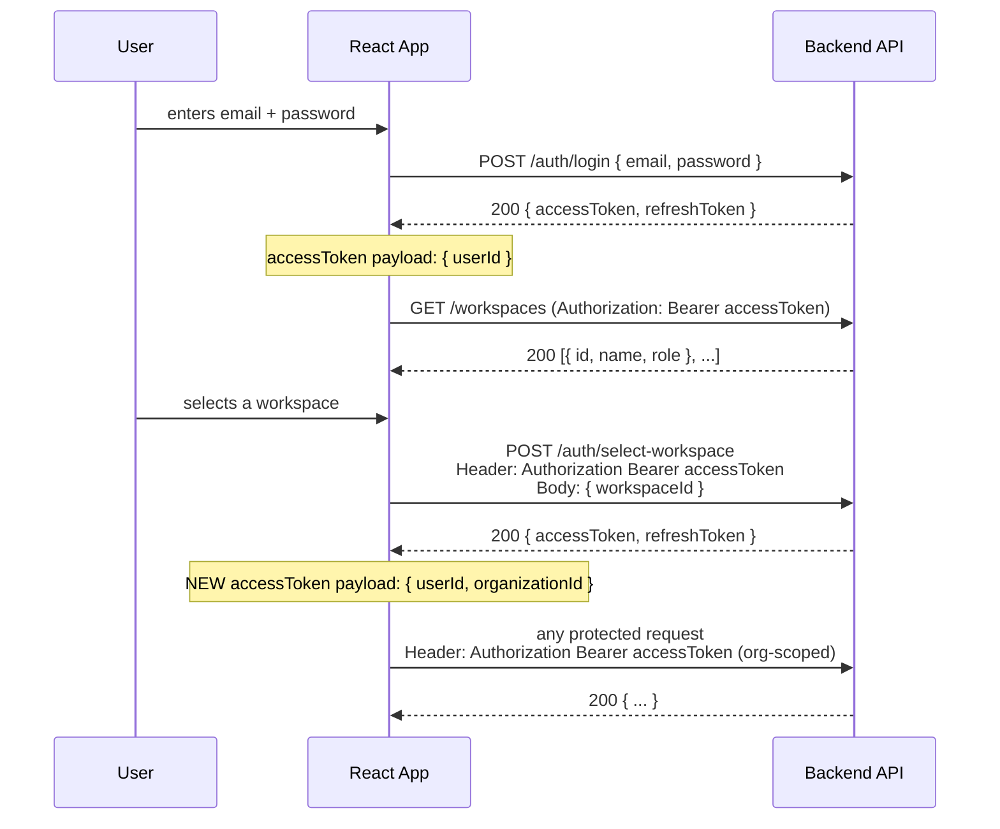
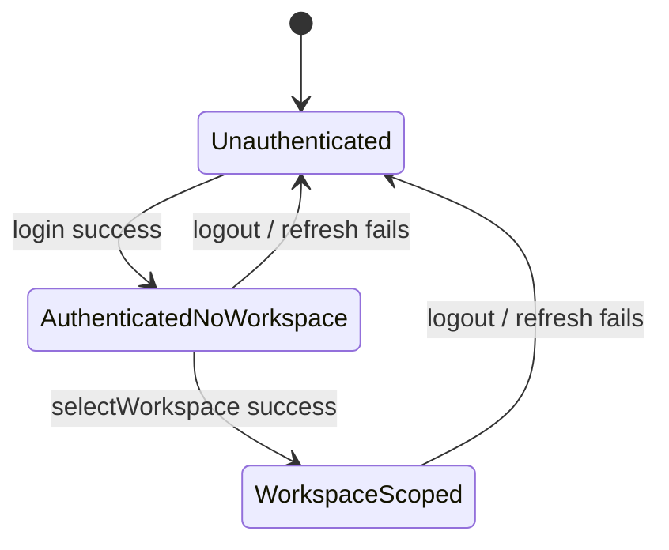

# Multi-Tenant Auth Flow — Architecture & Implementation Guide

## 1. The flow, restated



Three distinct trust levels exist in this flow, and the frontend needs to model all three explicitly rather than treating "logged in" as one boolean:

| Stage | Has valid tokens? | Token scope | What the user can do |
|---|---|---|---|
| **Unauthenticated** | No | — | See login page only |
| **Authenticated, no workspace** | Yes (`userId` only) | User-level | Fetch workspace list, call `select-workspace` — nothing else |
| **Authenticated + workspace-scoped** | Yes (`userId` + `organizationId`) | Org-level | Everything else |

Modeling these as three states (not two) is the main thing people get wrong — it's tempting to treat "has an access token" as "logged in," but here a user-level token is deliberately weaker than an org-scoped one and must not unlock org-scoped routes.

---

## 2. Where to store the tokens

**Recommendation: access token in memory (React state), refresh token in an `httpOnly` cookie set by the backend.**

| Storage | XSS-safe? | Survives refresh? | Notes |
|---|---|---|---|
| `httpOnly` cookie (backend-set) | ✅ Yes — JS can't read it | ✅ Yes | Best option, but requires backend cooperation (`Set-Cookie` on login/select-workspace responses) and CSRF protection (`SameSite=Strict/Lax` + CSRF token on state-changing requests) |
| React state / memory | ✅ Yes | ❌ No — lost on hard refresh | Fine for the **access token**, since it's short-lived and we re-derive it via refresh-on-load anyway |
| `localStorage` | ❌ No — readable by any injected script | ✅ Yes | Common in practice, acceptable if you don't render any unsanitized user HTML anywhere in the app, but it's the weakest option |

If your backend can't do `httpOnly` cookies right now, the fallback is:
- **Access token** → memory only (never persisted)
- **Refresh token** → `localStorage`, with the explicit caveat that this is your XSS blast radius

The implementation below supports both — swap `TokenStore` internals when your backend is ready for cookies.

---

## 3. Why an axios interceptor, not manual checks everywhere

Every protected call needs to:
1. Attach the current access token
2. If the call comes back `401`, attempt exactly one silent refresh, retry the original call once, and only log the user out if the refresh itself fails
3. Not fire 10 parallel refresh calls if 10 requests 401 at the same moment (request should be **queued**, not duplicated)

Doing this by hand in every component is how you end up with race conditions and duplicate refresh calls. Centralizing it in one axios instance means every feature just calls `api.get(...)` and never thinks about tokens again.

---

## 4. File map

```
src/
  lib/
    tokenStore.js      # single source of truth for tokens + auth stage
    httpClient.js       # axios instance + refresh interceptor
    authApi.js          # login / workspaces / selectWorkspace calls
  context/
    AuthContext.jsx      # exposes { stage, user, workspace, login, selectWorkspace, logout }
  routes/
    ProtectedRoute.jsx   # gate by required auth stage
  pages/
    Login.jsx
    WorkspaceSelect.jsx
  hooks/
    useAuth.js
```

## 5. State machine



## 6. Route guarding

```
/login                 -> public, redirect to /workspaces if already AuthenticatedNoWorkspace+
/workspaces             -> requires stage >= AuthenticatedNoWorkspace
/app/*                   -> requires stage === WorkspaceScoped
```

`ProtectedRoute` takes a `minStage` prop and compares against the current stage from context — see `routes/ProtectedRoute.jsx`.

## 7. Handling the "same accessToken, different payload" quirk

Because the *shape* of the access token payload changes after `select-workspace` (adds `organizationId`), never decode-and-trust the JWT payload on the frontend as your source of truth for `stage`. Instead:
- Track `stage` explicitly in `AuthContext` state, set it at each transition (`login()` sets `AuthenticatedNoWorkspace`, `selectWorkspace()` sets `WorkspaceScoped`)
- Only use the decoded JWT for *display* purposes (e.g., showing `organizationId` in a debug panel), never for gating

This avoids a subtle bug where a stale org-scoped token in storage from a previous session gets treated as valid for the *current* login just because it decodes successfully.

## 8. Logout

Logout must:
1. Call `POST /auth/logout` (invalidate refresh token server-side — critical, otherwise a stolen refresh token remains valid forever)
2. Clear the access token from memory
3. Clear the refresh token (cookie gets cleared by the backend's `Set-Cookie` with `Max-Age=0`, or if using localStorage, remove it client-side)
4. Reset `stage` to `Unauthenticated`
5. Redirect to `/login`

## 9. Common pitfalls this design avoids

- **Treating "has a token" as "logged in"** — see the 3-stage table above
- **Refreshing on every request instead of only on 401** — wasteful, and races with concurrent requests
- **Firing N parallel refresh calls** — the interceptor below queues concurrent 401s behind a single in-flight refresh
- **Trusting client-decoded JWT for routing decisions** — explicit `stage` state instead
- **Forgetting server-side refresh token invalidation on logout** — a token that's merely "forgotten" client-side is still valid if intercepted earlier
